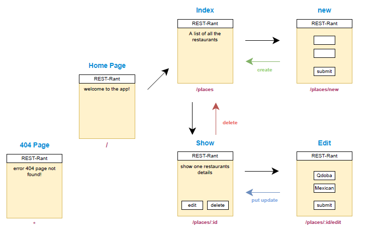

# Project REST-Rant

REST-Rant is an app where users can review restaurants.

As a lover of food, I needed a place to easily store all of my restaurant visits so I can store my person reviews of them easily and efficiently.

## Views & Routes

## Methods

| Method |  Path |    Purpose |
|     :---:      |      :---:      |        :---:      |
| git status     |  git status     |    git status     |
| git diff       |  git diff       |    git diff       |